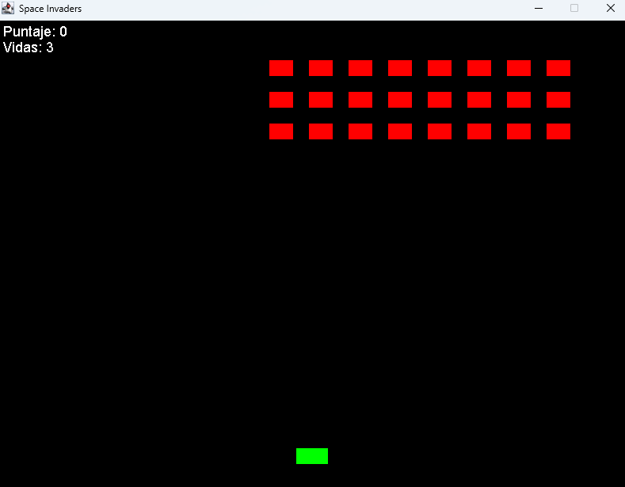

<p align="center">  </p>

# Space Invaders en Java
### ¿Qué es Space Invaders?

`Space Invaders` es un clásico juego arcade, originalmente lanzado en 1978. Desarrollado en Java, este proyecto tiene como objetivo recrear la experiencia lúdica del juego original, ofreciendo a la vez un recurso educativo para el aprendizaje de conceptos de programación, diseño de juegos y manejo de eventos gráficos.

### Estructura del Repositorio
El repositorio se organiza en las siguientes carpetas y archivos principales:
- **Código**  
  Contiene el código fuente principal del proyecto. Aquí se encuentran las clases y paquetes que implementan la lógica del juego, la interfaz gráfica, el manejo de colisiones, y otros elementos fundamentales que permiten la ejecución de _Space Invaders_.
- **Lessons**  
  Incluye recursos educativos y ejemplos prácticos relacionados con el desarrollo del juego, proporcionados por Davide Grappolo. Esta carpeta puede contener lecciones, notas y documentación adicional que facilitan la comprensión y extensión del proyecto.

### Requisitos

- **Java**: Se recomienda utilizar JDK 8 o una versión superior.
- **Entorno de Desarrollo (IDE)**: Aunque es posible compilar y ejecutar el proyecto desde la línea de comandos, se recomienda el uso de un IDE como [IntelliJ IDEA](https://www.jetbrains.com/idea/download/?section=windows) (en preferencia), Eclipse o NetBeans para facilitar la edición, compilación y depuración del código.

## Instrucciones de Instalación y Ejecución

1. **Clonación del Repositorio**

   Clona el repositorio en tu ordenador ejecutando:

   ```bash
   git clone https://github.com/masdlave/Space-Invaders-en-Java.git

3. **Ejecución del juego**

   Normalmente, presionando `F5` se ejecuta automáticamente. Si esto no funciona, pruebe a ejecutarlo desde su botón de "Run":
   <p align="center">  </p>

<h1 align="center"> Juego </h1>
<p align="center">  </p>

#### Créditos
- **Autor:** [@masdlave](https://github.com/masdlave) | Maria Salazar
- [Space Invaders](https://www.space-invaders.com/home/) de 1978
- Lessons y explicaciones por [Davide Grappolo](https://x.com/davidegrappolo)
